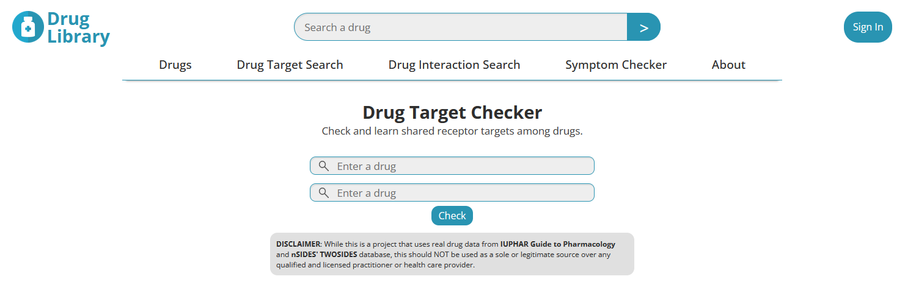

# Drug Library (Frontend)

**Drug Library** is a web-based frontend project for exploring drugs, checking drug-drug interactions (DDIs), and searching for shared receptor targets. It is currently a static interface built with HTML and CSS, with plans to connect to an already developed backend API in the future. The API can be found [here](https://github.com/imtimtam/ddi-api).

## Demo Features
- **Drug Interaction Search**: Enter two drugs to check for potential interactions (backend connection coming soon).
- **Drug Target Search**: Explore drug targets (planned).
- **Symptom Checker**: Explore drug-related symptoms and what may be causing them (planned).

## Design Features
- **Modular CSS**: Styles are organized into components to enable maintainable and scalable code and structure.
- **Variable Styling**: Uses CSS variables for colors, fonts, backgrounds and theme consistency.
- **BEM Design**: Structure follows Block Element Modifier methodology to ensure predictable and clear design.
- **Flex Properties**: Ensure responsive, readable pages.
- **Clean Header and Navigation**: Reusable header components and minimalistic navigation with hover and active states that are easy on the eyes.
- **Google Fonts Integration**: `Open Sans` used for modern, readable typography.

## Technologies
- HTML5
- CSS3
- Google Fonts: `Open Sans`

## Getting Started

**Prerequisites**

- A modern web browser (Chrome, Firefox, etc.)
- Live Server extension in VS Code

**1. Clone and move to the repository**

    git clone https://github.com/imtimtam/ddi-web

**2. Run with Live Server**
- Right-click `index.html` and **Open with Live Server**.

## Roadmap
- Connect frontend to backend API for data.
- Add JavaScript for interactive search, filtering and dynamic results.
- Improve responsive design and add potential animations.

## License

This project is licensed under the MIT License.

## Credits

- **Icons and Images** – Pixabay (free under [Pixabay License](https://pixabay.com/service/license/))